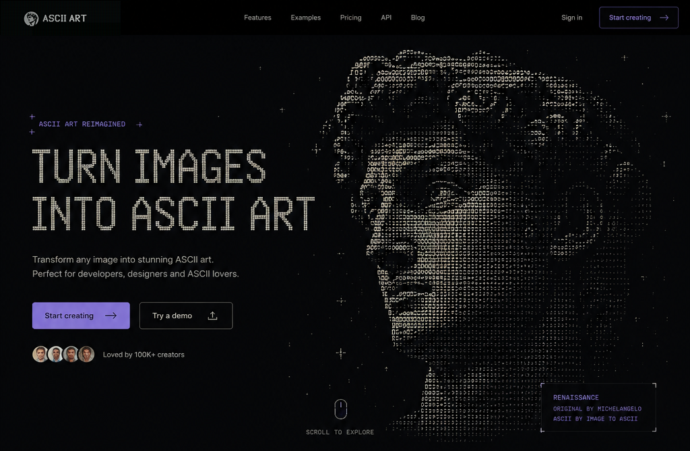

# ASCII ART

> Free ASCII art generator. Turn any photo, text or video into ASCII art, pixel art, glitch or mosaic — runs entirely in your browser, no signup, no upload.

[](https://asciiart.app)

Site: https://asciiart.app/

## Features

✨ **Core Functionality**

- Upload any image (JPG, PNG, WebP) and convert to ASCII art instantly
- AI image generation — describe what you want, get ASCII art
- 4 character styles: Standard, Detailed, Blocks, Minimal
- Real-time controls: detail level, charset, invert, color
- Export as PNG or copy as plain text
- 100% client-side — your images never leave your device

🎨 **Visual Design**

- CRT/terminal aesthetic with phosphor green on black
- GeistPixel-Square pixel font
- ASCII rain animation background
- Scanline overlays and boot sequence
- Responsive design (mobile-friendly)

## Quick Start

```bash
# Install dependencies
pnpm install

# Set up database
pnpm db:setup
pnpm db:push

# Start dev server
pnpm dev
```

Visit http://localhost:3000

## Usage

### Upload Mode

1. Click "Start creating" or scroll to the tool section
2. Drag & drop an image or click to browse
3. Adjust settings (detail, charset, invert, color)
4. Download PNG or copy as text

### AI Generation Mode

1. Switch to "Generate with AI" tab
2. Describe the image you want
3. Choose aspect ratio (1:1, 16:9, 9:16)
4. Click "Generate image"
5. Wait for AI to create and convert to ASCII

## Tech Stack

- **Framework:** TanStack Start (React 19, TypeScript)
- **Styling:** Tailwind CSS 4 + custom CRT design system
- **Database:** SQLite (Drizzle ORM)
- **Auth:** better-auth (optional, not required for core features)
- **AI:** Replicate/Gemini/Fal (configurable in admin panel)

## Project Structure

```
src/
├── blocks/              # Landing page sections
│   ├── header.tsx       # Sticky nav with mobile drawer
│   ├── hero.tsx         # Compare slider + typewriter
│   ├── tool.tsx         # ASCII conversion tool (CORE)
│   ├── ask-ai.tsx       # AI feature explanation
│   ├── use-cases.tsx    # Marquee ticker
│   ├── learn.tsx        # How it works
│   ├── faq.tsx          # FAQ accordion
│   ├── cta.tsx          # Final CTA
│   └── footer.tsx       # Filesystem tree footer
├── components/
│   └── crt-effects.tsx  # Boot sequence, rain, scanlines
├── routes/
│   ├── __root.tsx       # Root layout with CRT styles
│   ├── index.tsx        # Landing page composition
│   └── api/
│       ├── generate.ts  # AI generation endpoint
│       └── status/      # Task status polling
└── styles/
    ├── globals.css      # Global styles + CRT theme
    └── crt-system.css   # CRT design system tokens
```

## Configuration

### Environment Variables

Copy `.env.example` to `.env.development` and set:

- `VITE_APP_URL` — Your domain (default: https://asciiart.app)
- `VITE_APP_NAME` — App name (default: ASCII ART)
- `DATABASE_URL` — Database connection (default: SQLite)

### AI Generation

To enable real AI image generation:

1. Go to `/admin/settings`
2. Configure an AI provider (Replicate, Gemini, or Fal)
3. The API routes will automatically use the configured provider

## Deployment

### Local Production

```bash
pnpm build
pnpm start
```

### Cloudflare Workers

```bash
pnpm cf:build
pnpm cf:deploy
```

## Customization

### Change Colors

Edit `src/styles/globals.css`:

- `--ia-fg` — Phosphor green (default: #33ff33)
- `--ia-bg` — Background (default: #0a0a0c)
- `--ia-amber` — Accent (default: #ff9d00)

### Change Fonts

Edit `src/styles/globals.css`:

- `--font-pixel` — Display font (GeistPixel-Square)
- `--font-mono` — Body font (system monospace)

### Update Translations

Edit `messages/en.json` and `messages/zh.json`:

- All landing page text is under `landing.*` keys
- Use flat dot-keyed format: `landing.hero.title`, `landing.tool.subtitle`, etc.

## Easter Eggs

Type "matrix" anywhere on the page (without clicking an input) to boost the ASCII rain effect! 🎬

## License

MIT — Use freely for personal or commercial projects.

## Credits

Design inspired by CRT terminals and retro computing aesthetics.

---

**Made with ❤️ and ASCII art**
